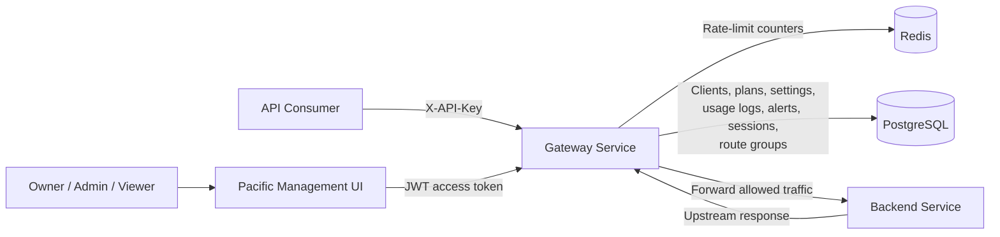
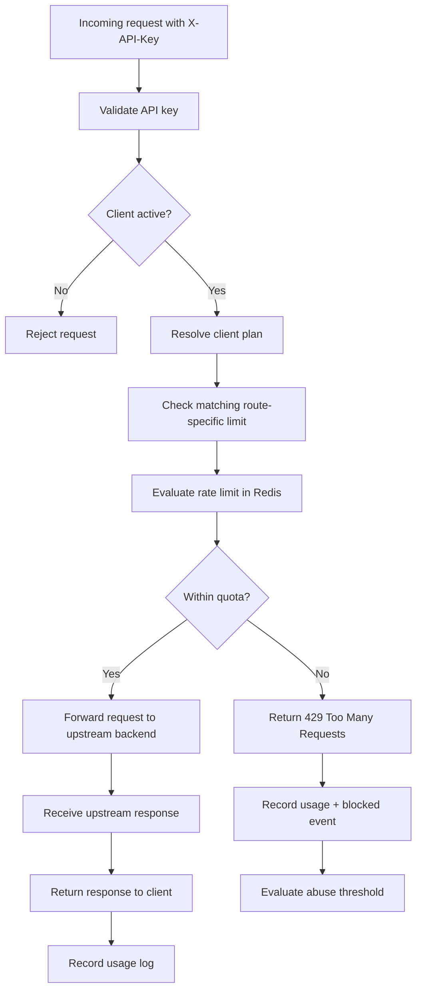
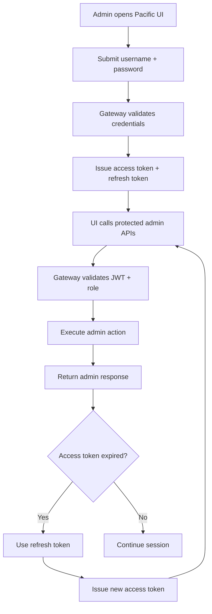
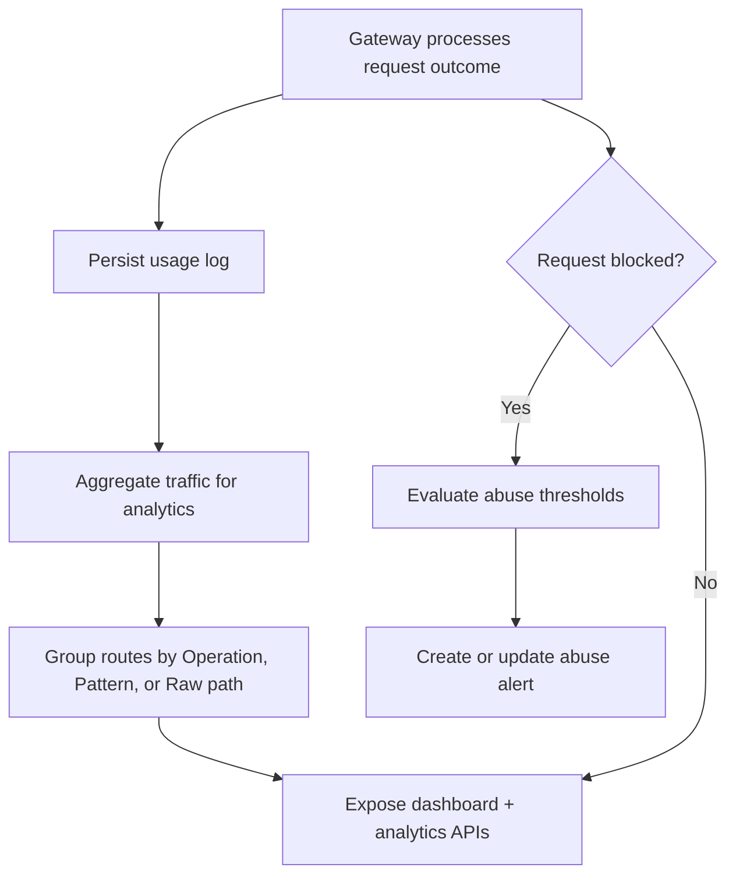
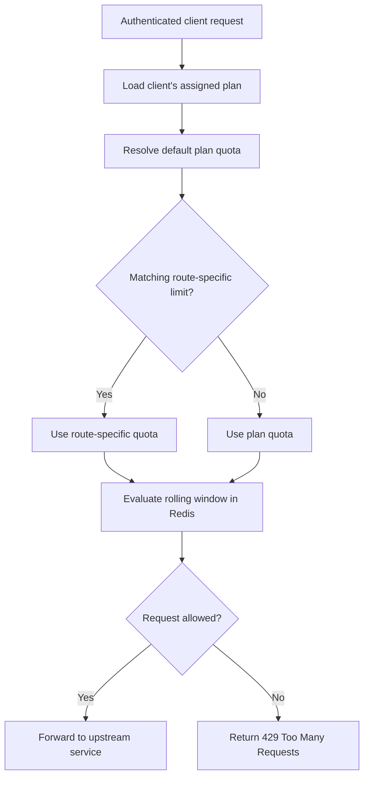

# Pacific — Smart API Gateway

Pacific is a self-hostable API gateway and API management platform for teams that need API keys, rate limits, usage analytics, abuse alerts, and a clean operator UI without adopting a large enterprise gateway stack.

Built with Spring Boot, Redis, PostgreSQL, Docker, and a responsive React management UI.

Pacific is designed as a developer-first, SaaS-oriented gateway platform for small-to-mid sized teams.

## Why This Project?

Modern applications increasingly rely on API gateways for authentication,
traffic management, rate limiting, observability, and security.

Existing solutions such as Kong, AWS API Gateway, Apigee, and NGINX-based setups
are powerful, but can be very expensive and often optimized toward either:

- infrastructure-heavy configurations
- enterprise-scale deployments
- or paid platform ecosystems

At the same time, many free open-source gateway solutions provide strong routing and proxy capabilities but lack 
built-in product-oriented features such as:
- plan-based quota management
- integrated analytics
- abuse monitoring
- developer-focused administration
- and simplified onboarding experiences

Pacific was built to explore a middle ground:
a developer-first, self-hostable API management platform that combines infrastructure capabilities with SaaS-style management features.

The goal is not to compete with low-level high-performance proxies,
but to provide a more accessible and product-oriented gateway experience for developers, startups, and small-to-mid sized teams.

## Current Capabilities

- API key authentication for protected gateway routes.
- Client lifecycle management, including API key rotation, active/disabled states, plan assignment, and stale-client visibility.
- Redis-backed sliding-window rate limiting with plan quotas and route-specific wildcard overrides.
- Dashboard, client, route, and time-series traffic analytics with 7d, 30d, 90d, and 12m ranges.
- Route analytics grouped by developer-defined operations, normalized route patterns, or raw request paths.
- Configurable route groups with method-aware Exact, Prefix, and Glob matching rules.
- Usage logging and abuse detection with `OPEN`, `ACKNOWLEDGED`, and `RESOLVED` alert states.
- JWT admin authentication with refresh sessions, logout, password reset, strong password enforcement, and role-based access control.
- Last-owner protection with optional break-glass Owner recovery guarded by `ADMIN_RECOVERY_TOKEN`.
- Manual client management through the Pacific UI and admin API.
- Server-to-server client onboarding through restricted provisioning tokens.
- Database-backed gateway settings for upstream routing, health checks, request timeout, and connection testing.
- Dockerized services and a responsive React management UI for desktop and mobile operation.

## Architecture Overview

Pacific is a containerized, multi-service API management platform. The Gateway Service sits between API consumers, platform operators, and upstream backend services, enforcing traffic policies while exposing administrative APIs through the Pacific Management UI.



### API Consumer Request Flow



### Admin Platform Flow



### Analytics and Abuse Monitoring Flow



### Service Responsibilities

| Service | Responsibility |
|---|---|
| **Pacific Management UI** | React and TypeScript operator interface for managing clients, plans, rate limits, route groups, analytics, abuse alerts, admins, provisioning tokens, and gateway settings. It communicates with the Gateway Service through the browser-accessible API. |
| **Gateway Service** | Core Spring Boot application responsible for API key validation, client-state checks, quota resolution, Redis-backed rate limiting, upstream forwarding, usage logging, abuse detection, admin authentication, role-based authorization, provisioning, and runtime gateway configuration. |
| **Redis** | Stores shared sliding-window rate-limit counters so multiple gateway instances can evaluate requests against the same quota state. |
| **PostgreSQL** | Stores persistent platform data, including clients, plans, route limits, route groups, gateway settings, usage logs, abuse alerts, admins, refresh sessions, and provisioning tokens. |
| **Backend Service** | Demonstration upstream application used for routing examples, integration testing, and validating gateway behavior. |

## Core Features

### Traffic Management

Pacific applies traffic policies at the gateway before requests reach the upstream service.



#### Plan-Based Quotas

Clients are assigned to centralized plans with configurable default request limits. Pacific seeds `FREE`, `PRO`, and `ENTERPRISE` plans for local demonstrations, and operators can create additional plans through the UI or admin API.

Updating a plan changes the default quota for clients assigned to it without requiring individual client configuration.

#### Route-Specific Rate Limits

Routes with different operational costs can override a plan’s default quota.

For example, report generation or AI-processing endpoints can use stricter limits than lightweight read endpoints while remaining part of the same client plan.

Supported route patterns include:

- exact paths, such as `/api/products`
- one-segment wildcards, such as `/api/users/*`
- nested wildcards, such as `/api/reports/**`

When multiple policies could apply, the matching route-specific limit takes precedence over the plan default.

#### Redis-Backed Sliding Window

Pacific evaluates quotas using Redis-backed sliding-window counters over a rolling 60-second period.

Because rate-limit state is stored outside the gateway process, multiple gateway instances can share the same counters instead of enforcing separate in-memory limits.

### Gateway Configuration

Gateway forwarding settings are stored in PostgreSQL and can be managed through the Pacific UI or admin API.

Current settings include:

- upstream base URL
- health-check path
- request timeout

The gateway uses the saved upstream URL when valid configuration is available. If runtime configuration is unavailable, it falls back to deployment configuration such as `BACKEND_SERVICE_URL`.

Operators can test saved or draft settings before applying them using:

```http
POST /admin/settings/gateway/test-connection
```

## Infrastructure & Deployment

### Dockerized Multi-Service Architecture

The platform is fully containerized using Docker and Docker Compose.

Separate containers are used for:
- Management UI
- Gateway Service
- Backend Service
- Redis
- PostgreSQL

This keeps infrastructure responsibilities isolated and creates a more production-like development environment.

### Container Networking

Services communicate through Docker Compose networking using service-level DNS resolution rather than localhost-based communication.

This more closely mirrors real distributed backend deployments where services communicate across isolated runtime environments.

### Environment-Based Configuration

Service configuration is managed through environment variables and container configuration rather than hardcoded infrastructure settings.

This simplifies deployment portability and environment-specific configuration management.

#### Deployment Configuration

Root `.env.example` documents the local/demo variables used by Docker Compose. Public deployments should provide real secret values through the deployment platform instead of committing a `.env` file.

For deployment beyond localhost, see [Deployment Guide](docs/DEPLOYMENT.md).

For Railway-specific deployment notes, see [Railway Deployment](docs/RAILWAY_DEPLOYMENT.md).

For a polished walkthrough, see [Demo Script](docs/DEMO_SCRIPT.md).

| Variable | Purpose | Local/demo value |
|---|---|---|
| `POSTGRES_DB` | PostgreSQL database created by the local container | `gateway_db` |
| `POSTGRES_USER` | PostgreSQL user created by the local container | `postgres` |
| `POSTGRES_PASSWORD` | PostgreSQL password for local Compose | replace before deployment |
| `SPRING_DATASOURCE_URL` | Gateway JDBC URL | `jdbc:postgresql://postgres:5432/gateway_db` |
| `SPRING_DATASOURCE_USERNAME` | Gateway database username | `postgres` |
| `SPRING_DATASOURCE_PASSWORD` | Gateway database password | replace before deployment |
| `SPRING_JPA_SHOW_SQL` | Opt-in Hibernate SQL statement logging for local query debugging | `false` |
| `SPRING_DATA_REDIS_HOST` | Redis host used by the gateway | `redis` |
| `SPRING_DATA_REDIS_PORT` | Redis port used by the gateway | `6379` |
| `JWT_SECRET` | Admin JWT signing secret | replace with a long random secret |
| `JWT_EXPIRATION_MS` | Admin access token lifetime | `3600000` |
| `ADMIN_REFRESH_TOKEN_EXPIRATION_MS` | Admin refresh token lifetime | `604800000` |
| `ADMIN_RECOVERY_TOKEN` | Optional break-glass token enabling `POST /admin/recovery/owner`; leave unset to disable recovery | unset |
| `BACKEND_SERVICE_URL` | Fallback upstream backend URL for gateway routing | `http://backend-service:8081` |
| `CORS_ALLOWED_ORIGINS` | Comma-separated allowed management UI origins | local UI origins |
| `VITE_API_BASE_URL` | Browser-visible gateway/admin API base URL embedded into the UI bundle | `http://localhost:8080` |

The management UI runs in the browser, so `VITE_API_BASE_URL` must be reachable by the user's browser. For local Docker Compose this is `http://localhost:8080`. For public deployment it should be the public gateway/admin API URL, not Docker-internal names such as `gateway-service`.

`CORS_ALLOWED_ORIGINS` must list the deployed UI origin exactly. The gateway rejects wildcard `*` origins; use explicit origins when deploying.

Local Docker Compose uses demo/local defaults when no `.env` file is present. Deployment environments should override passwords, `JWT_SECRET`, URLs, and CORS origins. No Spring profile split is required today; configuration is environment-variable driven.

SQL logging is disabled by default so public deployment logs stay readable. Set `SPRING_JPA_SHOW_SQL=true` locally only when debugging database queries.

Health endpoints are intentionally lightweight: the gateway exposes `GET /health`, and the demo backend exposes `GET /health`.

Seeded demo admins, demo API keys, and the local `demo-provisioning-token` remain for local demos. Before a public demo or production deployment, decide whether to disable seed data, rotate seeded values, or replace demo seeding with deployment-specific bootstrap data.

### Production-Oriented Separation

The architecture separates:
- traffic management
- backend business services
- distributed caching/state
- persistent storage

into independent services that can be scaled, replaced, or deployed separately.

## Getting Started

### Prerequisites

Before running the project, ensure Docker is installed and running. An API tester such as Insomnia or Postman is optional but useful.

---

### Clone the Repository

```bash
git clone https://github.com/pchak00/smart-api-gateway.git
cd smart-api-gateway
```

---

### Start the Platform

Build and start all services:

```bash
docker compose up --build
```

This starts the following services:

| Service | Port |
|---|---|
| Management UI | `3000` |
| Gateway Service | `8080` |
| Backend Service | `8081` |
| PostgreSQL | `5432` |
| Redis | `6379` |

Open the management UI in your browser:

```text
http://localhost:3000
```

The gateway and admin API are available at:

```text
http://localhost:8080
```

The browser-based frontend calls `http://localhost:8080`. The Docker hostname `gateway-service` is only for container-to-container networking and is not used by browser code.

---

### Quick Demo

1. Start the full stack:

```bash
docker compose up --build
```

2. Open the Pacific management UI:

```text
http://localhost:3000
```

3. Log in as a seeded owner:

```text
username: owner
password: Coastal gateway passphrase 2026!
```

4. Inspect the Dashboard and Analytics pages. They use real backend usage logs and aggregate data from gateway traffic.

5. Create or inspect an API client in the Clients page. For a clean local database, the seeded free client has this API key:

```text
free-demo-api-key
```

6. Call a protected route through the gateway:

```bash
curl -i http://localhost:8080/api/products \
  -H "X-API-Key: free-demo-api-key"
```

7. Trigger rate limiting on the seeded FREE `/api/products` route limit, which allows 5 requests per minute:

```bash
for i in {1..15}; do
  curl -i http://localhost:8080/api/products \
    -H "X-API-Key: free-demo-api-key"
  echo
done
```

8. Return to the UI and confirm Dashboard and Analytics values update, blocked requests appear, and an abuse alert appears once the blocked-request threshold is crossed. The Routes page contains Rate limits and Route groups; route groups are used by operation-level analytics. As `owner` or `super admin`, acknowledge or resolve the alert from Abuse Alerts.

9. Log out and sign in as the seeded viewer:

```text
username: viewer
password: Coastal gateway passphrase 2026!
```

The viewer can inspect allowed data but cannot mutate resources. The Admins area is blocked, and mutation controls are disabled or guarded.

---

### Verify the Gateway

Example request using an API key:

```bash
curl -X GET http://localhost:8080/api/products \
  -H "X-API-Key: free-demo-api-key"
```

---

### Stop the Platform

```bash
docker compose down
```

If your local database volume contains stale seeded data and you need a clean demo database:

```bash
docker compose down -v
```

## API Usage Examples

### Demo Credentials

The application automatically seeds demo data when the database is empty.

#### Admins

| Username | Password | Role |
|-----------|-----------|---------|
| owner | Coastal gateway passphrase 2026! | OWNER |
| super admin | Coastal gateway passphrase 2026! | SUPER_ADMIN |
| viewer | Coastal gateway passphrase 2026! | READ_ONLY_ADMIN |

#### Plans

| Plan | Requests Per Minute |
|------|---------------------|
| FREE | 10 |
| PRO | 100 |
| ENTERPRISE | 1000 |

#### Demo Clients

| Client | API Key | Plan |
|---------|---------|------|
| Demo Free Client | `free-demo-api-key` | FREE |
| Demo Pro Client | `pro-demo-api-key` | PRO |

#### Demo Provisioning Token

The local seed includes `demo-provisioning-token`, restricted to the `FREE` plan. This value is for local development only.

---

### Authentication

Obtain a short-lived JWT access token before accessing administrative endpoints. Login also returns a longer-lived refresh token for active admin sessions. The refresh token is only accepted by `/auth/refresh`; it does not authorize `/admin/**` requests directly.

#### Login

```bash
curl -X POST http://localhost:8080/auth/login \
-H "Content-Type: application/json" \
-d '{
  "username":"owner",
  "password":"Coastal gateway passphrase 2026!"
}'
```

#### Response

```json
{
  "token":"eyJhbGciOiJIUzI1NiJ9...",
  "refreshToken":"admref_...",
  "username":"owner",
  "role":"OWNER",
  "expiresInMs":3600000
}
```

Use the token for all admin endpoints:

```http
Authorization: Bearer <token>
```

Refresh an active admin session:

```bash
curl -X POST http://localhost:8080/auth/refresh \
-H "Content-Type: application/json" \
-d '{"refreshToken":"admref_..."}'
```

Logout revokes the refresh token:

```bash
curl -X POST http://localhost:8080/auth/logout \
-H "Content-Type: application/json" \
-d '{"refreshToken":"admref_..."}'
```

Token lifetimes are configured with `JWT_EXPIRATION_MS` for access tokens and `ADMIN_REFRESH_TOKEN_EXPIRATION_MS` for refresh sessions.

---

### Dashboard, Analytics, Settings, and Alerts

Useful read endpoints for the demo:

```bash
curl http://localhost:8080/admin/dashboard/summary \
  -H "Authorization: Bearer <token>"

curl http://localhost:8080/admin/analytics/traffic \
  -H "Authorization: Bearer <token>"

curl "http://localhost:8080/admin/analytics/traffic?startDate=2026-07-01&endDate=2026-07-07" \
  -H "Authorization: Bearer <token>"

curl http://localhost:8080/admin/analytics/routes \
  -H "Authorization: Bearer <token>"

curl "http://localhost:8080/admin/analytics/routes?startDate=2026-07-01&endDate=2026-07-07&groupBy=OPERATION" \
  -H "Authorization: Bearer <token>"

curl "http://localhost:8080/admin/analytics/route-traffic?startDate=2026-07-01&endDate=2026-07-07&groupBy=PATTERN" \
  -H "Authorization: Bearer <token>"

curl http://localhost:8080/admin/analytics/clients \
  -H "Authorization: Bearer <token>"

curl "http://localhost:8080/admin/analytics/clients?planName=FREE&startDate=2026-07-01&endDate=2026-07-07" \
  -H "Authorization: Bearer <token>"

curl http://localhost:8080/admin/settings/gateway \
  -H "Authorization: Bearer <token>"

curl "http://localhost:8080/admin/abuse-alerts?status=OPEN" \
  -H "Authorization: Bearer <token>"
```

Analytics date parameters use ISO dates. Route analytics endpoints accept `groupBy=OPERATION`, `groupBy=PATTERN`, or `groupBy=RAW_PATH`; the default is `OPERATION`. The Pacific UI's 7d, 30d, 90d, and 12m controls generate explicit `startDate` and `endDate` values for these endpoints.

Gateway settings can be updated by an Owner or Admin:

```bash
curl -X PUT http://localhost:8080/admin/settings/gateway \
  -H "Authorization: Bearer <token>" \
  -H "Content-Type: application/json" \
  -d '{
    "upstreamBaseUrl":"http://backend-service:8081",
    "healthCheckPath":"/health",
    "timeoutMs":5000
  }'
```

Test a saved or draft upstream setting:

```bash
curl -X POST http://localhost:8080/admin/settings/gateway/test-connection \
  -H "Authorization: Bearer <token>" \
  -H "Content-Type: application/json" \
  -d '{
    "upstreamBaseUrl":"http://backend-service:8081",
    "healthCheckPath":"/health",
    "timeoutMs":5000
  }'
```

Abuse alerts support lifecycle actions for Owners and Admins:

```bash
curl -X PATCH http://localhost:8080/admin/abuse-alerts/<alert-id>/acknowledge \
  -H "Authorization: Bearer <token>"

curl -X PATCH http://localhost:8080/admin/abuse-alerts/<alert-id>/resolve \
  -H "Authorization: Bearer <token>"
```

---

### Plan Management

#### Create Plan

```bash
curl -X POST http://localhost:8080/admin/clients/plans \
-H "Authorization: Bearer <token>" \
-H "Content-Type: application/json" \
-d '{
  "planName":"STARTUP",
  "requestsPerMinute":250,
  "price":49.99
}'
```

#### Delete Plan

```bash
curl -X DELETE http://localhost:8080/admin/clients/plans/4 \
-H "Authorization: Bearer <token>"
```

#### Safety Rules

- Plans assigned to clients cannot be deleted.
- Plans referenced by route limits cannot be deleted.

---

### Client Management

#### Create Client

```bash
curl -X POST http://localhost:8080/admin/clients \
-H "Authorization: Bearer <token>" \
-H "Content-Type: application/json" \
-d '{
  "name":"Acme Corp",
  "planId":2,
  "active":true
}'
```

#### Rotate Client API Key

Owners and Admins can rotate a client API key. Viewers cannot rotate keys. Rotation replaces the stored key immediately: the old key stops authorizing gateway requests, and the new raw key is returned only in the rotation response. Copy it at rotation time.

```bash
curl -X POST http://localhost:8080/admin/clients/<client-id>/rotate-api-key \
-H "Authorization: Bearer <admin-token>"
```

#### Disable or Enable Client

Owners and Admins can disable or enable a client without changing its current API key. Disabled clients receive `403 Forbidden` on protected gateway routes until enabled again.

```bash
curl -X PATCH http://localhost:8080/admin/clients/<client-id>/disable \
-H "Authorization: Bearer <admin-token>"

curl -X PATCH http://localhost:8080/admin/clients/<client-id>/enable \
-H "Authorization: Bearer <admin-token>"
```

Future improvement: store client API keys as hashes with key-prefix lookup.

#### Current Client Onboarding

Manual admin provisioning remains available through the Pacific management UI or admin API. Trusted external backends can also create clients during signup through the server-to-server provisioning API, without using a full admin JWT.

Provisioning tokens are server-to-server secrets. They must stay in trusted backend systems and must never be used from browser code. A public developer self-service portal is future work and is not implemented in the current UI.

For server-to-server client onboarding, see [Client Provisioning](docs/CLIENT_PROVISIONING.md).

#### Server-to-Server Provisioning

Send `POST /provisioning/clients` with an `X-Provisioning-Token` header. Do not call this endpoint from browser code; it creates an active API client and returns its generated API key.

```bash
curl -X POST http://localhost:8080/provisioning/clients \
-H "X-Provisioning-Token: demo-provisioning-token" \
-H "Content-Type: application/json" \
-d '{
  "clientName":"signup-user-123",
  "planName":"FREE",
  "externalReference":"user_123"
}'
```

If `planName` is omitted, the token's default plan is used. A request cannot override that plan.

#### Upgrade Client Plan

```bash
curl -X PATCH http://localhost:8080/admin/clients/1/plan \
-H "Authorization: Bearer <token>" \
-H "Content-Type: application/json" \
-d '{
  "planId":3
}'
```

#### Delete Client

```bash
curl -X DELETE http://localhost:8080/admin/clients/1 \
-H "Authorization: Bearer <token>"
```

---

### Route Configuration

The Pacific UI labels this area as Routes and separates route configuration into Rate limits and Route groups.

Rate limits are enforcement rules. They override a plan's default quota for specific API paths. Backend API names still use route-limit terminology.

Route groups are analytics rules. They group related raw request paths into product-level operations, such as "Product catalog" or "Report generation", so route analytics can be read at the operation level instead of only as individual URLs.

#### Rate Limits

Route limits support exact paths and simple wildcard patterns. Use `*` for one path segment and `**` at the end of a pattern to match nested routes, such as `/api/users/*` or `/api/reports/**`. Exact paths still match only that path.

#### Create Route Limit

```bash
curl -X POST http://localhost:8080/admin/clients/routeLimits \
-H "Authorization: Bearer <token>" \
-H "Content-Type: application/json" \
-d '{
  "planId":1,
  "routePattern":"/api/reports",
  "requestsPerMinute":2
}'
```

Pattern examples:

- `/api/products` matches only `/api/products`
- `/api/users/*` matches `/api/users/123`
- `/api/reports/**` matches `/api/reports`, `/api/reports/daily`, and deeper nested paths

#### Update Route Limit

```bash
curl -X PATCH http://localhost:8080/admin/clients/route-limits/1 \
-H "Authorization: Bearer <token>" \
-H "Content-Type: application/json" \
-d '{
  "routePattern":"/api/reports",
  "requestPerMinute":5
}'
```

#### Delete Route Limit

```bash
curl -X DELETE http://localhost:8080/admin/clients/route-limits/1 \
-H "Authorization: Bearer <token>"
```

#### Route Groups

Route groups are configured at `/admin/route-groups` and contain one or more rules. Rules can optionally specify an HTTP method. If method is omitted, the rule can match any method.

Route group rule matching supports:

- `EXACT` — matches one normalized path exactly, such as `/api/products`.
- `PREFIX` — matches the path and nested children, such as `/api/reports` and `/api/reports/daily`.
- `GLOB` — supports whole-segment `*` and trailing `**`, such as `/api/users/*` or `/api/reports/**`.

Higher-priority active route groups are considered first for `OPERATION` analytics grouping.

```bash
curl -X POST http://localhost:8080/admin/route-groups \
-H "Authorization: Bearer <token>" \
-H "Content-Type: application/json" \
-d '{
  "name":"Product catalog",
  "description":"Read operations for product browsing",
  "active":true,
  "priority":10,
  "rules":[
    {
      "method":"GET",
      "pattern":"/api/products/**",
      "matchType":"GLOB"
    }
  ]
}'
```

#### Analytics Grouping

Route analytics endpoints accept `groupBy`:

- `OPERATION` groups by active route groups first, then falls back to normalized route patterns.
- `PATTERN` groups by normalized path patterns, replacing numeric segments with `:id` and UUIDs with `:uuid`.
- `RAW_PATH` groups by the raw request path shape.

---

### Admin Management

The UI labels this area as Admins. Backend endpoint paths continue to use `/admin/users`.

#### Create Admin

```bash
curl -X POST http://localhost:8080/admin/users \
-H "Authorization: Bearer <token>" \
-H "Content-Type: application/json" \
-d '{
  "username":"newadmin",
  "password":"<new-admin-password>",
  "role":"READ_ONLY_ADMIN"
}'
```

#### Promote Admin

```bash
curl -X PATCH http://localhost:8080/admin/users/2/role \
-H "Authorization: Bearer <token>" \
-H "Content-Type: application/json" \
-d '{
  "role":"SUPER_ADMIN"
}'
```

#### Reset Admin Password

Owners can reset passwords for any admin. Admins can reset Viewer passwords only. New passwords must pass the same admin password policy used at account creation.

```bash
curl -X PATCH http://localhost:8080/admin/users/2/password \
-H "Authorization: Bearer <token>" \
-H "Content-Type: application/json" \
-d '{
  "newPassword":"<new-admin-password>",
  "confirmPassword":"<new-admin-password>"
}'
```

#### Delete Admin

```bash
curl -X DELETE http://localhost:8080/admin/users/2 \
-H "Authorization: Bearer <token>"
```

#### Emergency Owner Recovery

`POST /admin/recovery/owner` is a break-glass recovery endpoint for restoring or creating an Owner account. It is disabled unless `ADMIN_RECOVERY_TOKEN` is set, and callers must provide the matching token in the `X-Admin-Recovery-Token` header.

```bash
curl -X POST http://localhost:8080/admin/recovery/owner \
-H "X-Admin-Recovery-Token: <recovery-token>" \
-H "Content-Type: application/json" \
-d '{
  "username":"owner",
  "newPassword":"<new-owner-password>",
  "confirmPassword":"<new-owner-password>"
}'
```

#### Safety Rules

- Owners can create, update, or delete Owner, Admin, and Viewer accounts.
- Admins can create or delete Viewer accounts, but cannot manage Owners or other Admins.
- Viewers cannot mutate admin users.
- The system prevents deletion or demotion of the last Owner.
- Admin passwords must be 12 to 128 characters, must not contain the username, must not be common/demo passwords, and must meet the built-in strength check.
- Emergency owner recovery should remain unset unless a deployment intentionally enables break-glass recovery.

---

### Gateway Usage

Clients authenticate using API keys.

```http
X-API-Key: <client-api-key>
```

---

#### Accessing a Protected Endpoint

```bash
curl -X GET http://localhost:8080/api/products \
-H "X-API-Key: free-demo-api-key"
```

#### Successful Response

```json
[
  {"id":1,"name":"Laptop","price":1299.99},
  {"id":2,"name":"Keyboard","price":89.99},
  {"id":3,"name":"Mouse","price":49.99}
]
```

---

#### Plan Based Rate Limiting

Each client inherits the request limit defined by its assigned plan.

| Plan | Requests Per Minute |
|--------|------------------|
| FREE | 10 |
| PRO | 100 |
| ENTERPRISE | 1000 |

These are seeded default plans; administrators can create additional custom plans.

---

#### Route Specific Rate Limiting

Route-specific limits override plan defaults.

Example:

```text
FREE Plan
├── Default: 10 requests/minute
├── /api/products: 5 requests/minute
└── /api/reports: 2 requests/minute
```

In this case:

- Requests to `/api/products` use the route-specific limit (5 RPM).
- Requests to `/api/reports` use the route-specific limit (2 RPM).
- Requests to `/api/orders` use the FREE plan limit (10 RPM).

---

#### Exceeding Rate Limits

When a client exceeds its allowed request rate:

```http
HTTP 429 Too Many Requests
```

Example:

```text
Rate limit exceeded
```

The gateway:

- Records the blocked request.
- Updates usage analytics.
- Evaluates abuse thresholds.
- Creates or updates alerts when thresholds are exceeded.

---

### Role Based Access Control

| Endpoint Type | READ_ONLY_ADMIN | SUPER_ADMIN | OWNER |
|--------------|-----------------|-------------|-------|
| View Data | allowed         | allowed     | allowed |
| Create Resources | denied          | allowed     | allowed |
| Update Resources | denied          | allowed     | allowed |
| Delete Resources | denied          | allowed     | allowed |

This separation allows operational users to monitor the platform while restricting configuration changes to Admin and Owner accounts.

The UI presents these roles with customer-facing labels Owner, Admin, and Viewer, while API payloads and JWT authorization continue to use `OWNER`, `SUPER_ADMIN`, and `READ_ONLY_ADMIN`.

## Upcoming Updates

Planned improvements and future platform enhancements include:

### Advanced Rate Limiting Algorithms

The current implementation uses Redis-backed sliding-window rate limiting for rolling 60-second enforcement.

Future versions will introduce:
- token bucket algorithms
- burst traffic handling
- dynamic quota policies

to provide more accurate and flexible traffic control behavior.

### Multi-Tenant Platform Support

Future versions will support tenant or organization-level resource management, allowing multiple teams or companies to manage clients, plans, and gateway configuration within isolated platform boundaries.

### Webhook-Based Alerting

The abuse detection system may be extended with webhook notifications for operational alerts such as:
- repeated rate limit violations
- suspicious traffic activity
- quota exhaustion events

### Platform Hardening and Configuration

Planned incremental improvements include:
- multi-upstream route mapping for more advanced deployments
- API key hashing with key-prefix lookup
- a public developer self-service portal
- richer alert notifications and webhook delivery
- pagination and filtering improvements for large admin datasets
- an isolated test profile or Testcontainers so Spring context tests do not require a local PostgreSQL instance

## Feedback & Contributions

Feedback, bug reports, and improvement suggestions are welcome.

If you encounter issues while running the platform or have ideas for improvements, feel free to open an issue or reach out through GitHub discussions.
