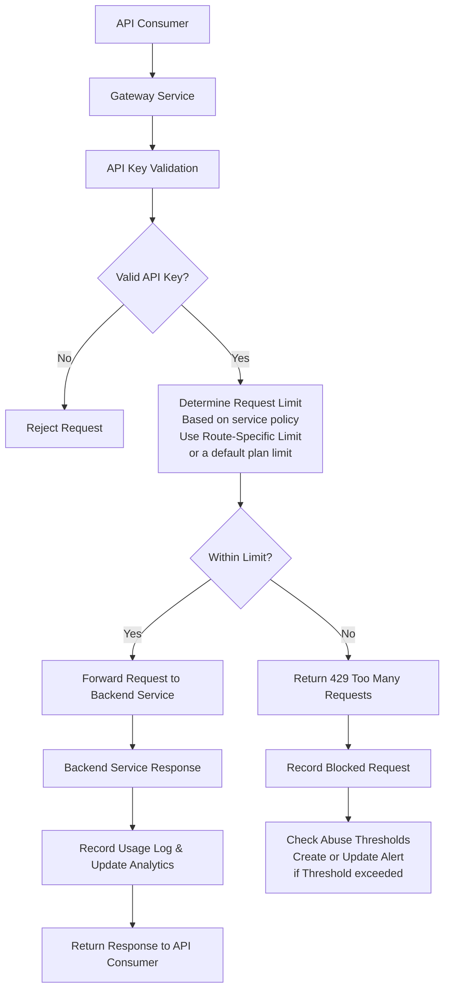
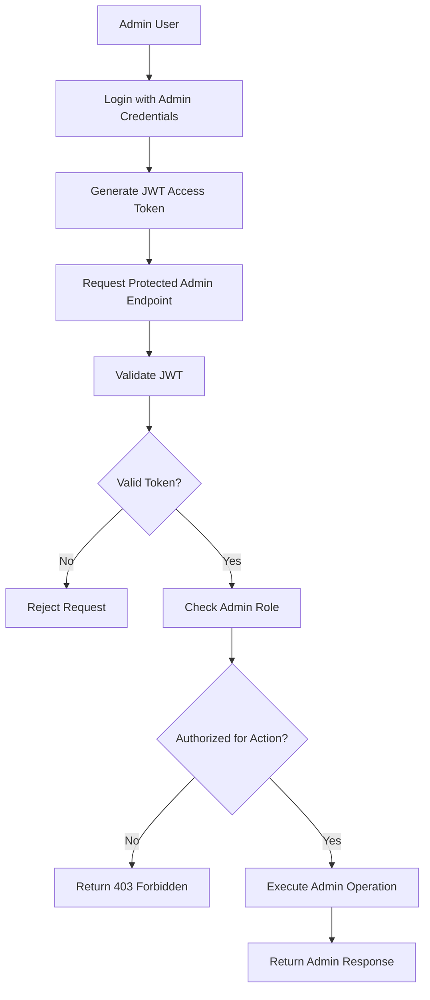

# Smart API Gateway

A self-hostable API gateway and API management platform built with Spring Boot, Redis, PostgreSQL, and Docker.

Features include:
- distributed Redis-backed rate limiting
- plan-based quotas
- route-specific throttling
- JWT admin authentication with refresh sessions
- role-based admin authorization
- usage analytics
- abuse detection with alert lifecycle

Designed as a developer-first, SaaS-oriented gateway platform for small-to-mid sized teams.

## Why This Project?

Modern applications increasingly rely on API gateways for authentication,
traffic management, rate limiting, observability, and security.

Existing solutions such as Kong, AWS API Gateway, Apigee, and NGINX-based setups
are powerful, but can be very expensive and often optimized toward either:

- infrastructure-heavy configurations
- enterprise-scale deployments
- or paid platform ecosystems

At the same time, many free open-source gateway solutions provide strong routing and proxy capabilities but lack 
built-in product-oriented features such as:
- plan-based quota management
- integrated analytics
- abuse monitoring
- developer-focused administration
- and simplified onboarding experiences

Smart API Gateway was built to explore a middle ground:
a developer-first, self-hostable API management platform that combines infrastructure capabilities with SaaS-style management features.

The goal is not to compete with low-level high-performance proxies,
but to provide a more accessible and product-oriented gateway experience for developers, startups, and small-to-mid sized teams.

## Current Capabilities

- API key authentication for protected gateway routes.
- Redis-backed rate limiting with plan quotas and route-specific wildcard overrides.
- Usage logging, dashboard metrics, route analytics, client analytics, and traffic analytics.
- Abuse detection with `OPEN`, `ACKNOWLEDGED`, and `RESOLVED` alert states.
- JWT admin login, refresh sessions, logout, and role-based access control.
- Manual client provisioning from the Pacific management UI or admin API.
- Server-to-server client provisioning with provisioning token management.
- DB-backed gateway settings for upstream URL, health check path, and timeout.
- Dynamic upstream routing with environment/default fallback and test connection support.
- Dockerized Pacific management UI for operating the gateway locally.

## Architecture Overview

Smart API Gateway is designed as a containerized, multi-service backend system where the gateway acts as the central policy enforcement layer between API consumers and backend services.

Instead of acting only as a request router, the gateway is responsible for enforcing access rules, applying traffic policies, recording usage, detecting abuse, and protecting administrative platform features.

The architecture is easiest to understand through two main request flows:

1. **API Consumer Flow** — requests made by external clients using API keys
2. **Admin Platform Flow** — requests made by admins using JWT authentication and role-based authorization

### API Consumer Flow

This flow represents requests made by external API consumers to protected backend services.




### Admin Platform Flow

Admin authentication is intentionally separated from API consumer authentication. API consumers access protected backend services using API keys, while platform administrators use JWT-based authentication to manage internal gateway resources and administrative features.

The platform supports three administrative roles:

- `OWNER` — owns the workspace and can manage high-privilege admins
- `SUPER_ADMIN` — manages gateway resources and viewer accounts
- `READ_ONLY_ADMIN` — can access read-only administrative endpoints such as analytics, usage statistics, view clients, plans, route-specific policies, and abuse alerts

This separation allows the platform to enforce role-based access control for sensitive management operations while still supporting restricted monitoring and observability access.



### Infrastructure & Service Responsibilities

The system is separated into multiple services so each component has a clear responsibility.

#### Gateway Service

The Gateway Service is the core application in the system. It acts as the central policy enforcement layer for incoming traffic.

Responsibilities include:

- validating API keys for API consumers
- resolving plan-based and route-specific rate limits
- forwarding valid requests to backend services
- recording usage logs for analytics
- tracking blocked requests for abuse detection
- protecting admin endpoints with JWT authentication and role-based authorization

#### Redis

Redis is used for fast, shared rate-limiting counters.

Rate limit state is kept outside the gateway process so the system is not dependent on local application memory. This allows multiple gateway instances to share request counters and supports a more horizontally scalable design.

#### PostgreSQL

PostgreSQL stores persistent platform data such as:

- clients and API keys
- plans and quota rules
- route-specific limits
- gateway settings
- usage logs
- abuse alerts
- admin users and roles

#### Backend Service

The Backend Service is a demo service used to validate gateway behavior.

It exists mainly for routing demonstrations, integration testing, and showing how protected backend APIs can sit behind the gateway.

#### Docker Compose

Docker Compose is used to run the full system locally with separate containers for the management UI, gateway, backend service, Redis, and PostgreSQL.

This creates a more production-like development environment and demonstrates container networking, service isolation, and infrastructure configuration.

## Core Features

### Traffic Management

#### Plan-Based Rate Limiting

Clients are assigned to centralized plans with configurable default request quotas. `FREE`, `PRO`, and `ENTERPRISE` are seeded defaults, and admins can create custom plans.

This allows quota policies to be managed centrally without duplicating configuration across individual clients.

#### Route-Specific Traffic Policies

The gateway supports route-level rate limit overrides for endpoints with different operational costs.

For example, expensive endpoints such as AI inference, image generation, or report-processing APIs can enforce stricter limits than lightweight endpoints, even when clients belong to the same plan.

When a route-specific policy exists, it overrides the default plan quota for that endpoint.

Patterns can be exact paths such as `/api/products`, one-segment wildcards such as `/api/users/*`, or nested wildcards such as `/api/users/**`.

#### Distributed Redis-Backed Rate Limiting

Pacific uses Redis-backed sliding-window rate limiting to enforce plan and route-specific quotas over a rolling 60-second window. This avoids fixed-window boundary bursts while preserving plan defaults and route override behavior, including exact paths, one-segment wildcards, and nested wildcard route limits.

This allows multiple gateway instances to share rate limit state consistently and supports a more horizontally scalable architecture compared to application-local counters.

#### Centralized Policy Enforcement

Traffic policies are enforced at the gateway layer before requests reach backend services.

This allows authentication, quota enforcement, and traffic control to remain centralized rather than being duplicated across individual backend applications.

#### Runtime Gateway Settings

Gateway settings are stored in PostgreSQL and exposed through the admin API at `GET /admin/settings/gateway` and `PUT /admin/settings/gateway`.

These settings currently include the intended upstream base URL, health-check path, and request timeout. They are runtime product configuration for admins to view and update without editing source code or environment variables.

Gateway forwarding uses the database upstream base URL when a valid settings row is available. If the settings row is missing, invalid, or temporarily unavailable, the gateway falls back to the existing deployment configuration such as `BACKEND_SERVICE_URL`.

Admins can test upstream reachability from the UI or with `POST /admin/settings/gateway/test-connection`. The endpoint accepts draft `upstreamBaseUrl`, `healthCheckPath`, and `timeoutMs` values, or uses the currently saved settings when the request body is empty. It sends a simple GET request to the joined health-check URL and returns whether the upstream responded with a 2xx status.

### Authentication & Authorization

#### API Key Authentication

External API consumers authenticate using API keys provided through the `X-API-Key` header.

Requests are validated at the gateway layer before traffic is forwarded to backend services.

#### JWT-Based Admin Authentication

Administrative platform endpoints are protected using JWT-based authentication.

Admins authenticate through a login endpoint and receive a signed JWT access token used for subsequent protected requests.

#### Role-Based Authorization

Administrative actions are protected using role-based access control.

Current roles include:

- `OWNER` — can manage high-privilege admins and all gateway resources
- `SUPER_ADMIN` — can manage gateway resources and viewer accounts
- `READ_ONLY_ADMIN` — can access monitoring and observability endpoints such as analytics, usage statistics, and abuse alerts

The Pacific UI presents these roles as Owner, Admin, and Viewer, but API payloads and JWT claims continue to use the backend enum values.

This separation allows sensitive platform operations to remain protected while still supporting restricted operational visibility for lower-privileged administrators.

#### Centralized Security Enforcement

Authentication and authorization are enforced centrally at the gateway layer rather than being duplicated across backend services.

This keeps security policies consistent across the platform and simplifies backend service design.

### Analytics & Abuse Detection

#### Usage Logging

Requests processed through the gateway are recorded for monitoring and analytics purposes.

Logged information includes:
- client identity
- request path
- HTTP method
- status code
- request timestamp
- allowed or blocked request state

#### Analytics & Monitoring

Usage data is aggregated to support operational analytics and platform monitoring.

This allows administrators to observe:
- request activity
- blocked traffic patterns
- client usage behavior
- route-level traffic trends

#### Abuse Detection

The platform monitors blocked request activity to identify potentially abusive behavior.

When clients repeatedly exceed configured rate limits within a defined time window, the system evaluates abuse thresholds and tracks suspicious activity patterns.

#### Alerting System

When blocked requests cross the abuse threshold, the gateway creates or updates abuse alerts associated with the affected client.

A cooldown mechanism is used to avoid repeatedly generating duplicate alerts for the same abusive activity window.

Abuse alerts use lifecycle states: `OPEN`, `ACKNOWLEDGED`, and `RESOLVED`. Dashboard `openAlertCount` counts only `OPEN` alerts, so resolved historical alerts no longer inflate the operational alert count.

Super admins can move alerts forward with `PATCH /admin/abuse-alerts/{id}/acknowledge` and `PATCH /admin/abuse-alerts/{id}/resolve`; read-only viewers can inspect alert lists only.

## Infrastructure & Deployment

### Dockerized Multi-Service Architecture

The platform is fully containerized using Docker and Docker Compose.

Separate containers are used for:
- Management UI
- Gateway Service
- Backend Service
- Redis
- PostgreSQL

This keeps infrastructure responsibilities isolated and creates a more production-like development environment.

### Container Networking

Services communicate through Docker Compose networking using service-level DNS resolution rather than localhost-based communication.

This more closely mirrors real distributed backend deployments where services communicate across isolated runtime environments.

### Environment-Based Configuration

Service configuration is managed through environment variables and container configuration rather than hardcoded infrastructure settings.

This simplifies deployment portability and environment-specific configuration management.

### Production-Oriented Separation

The architecture separates:
- traffic management
- backend business services
- distributed caching/state
- persistent storage

into independent services that can be scaled, replaced, or deployed separately.

## Getting Started

### Prerequisites

Before running the project, ensure Docker is installed and running. An API tester such as Insomnia or Postman is optional but useful.

---

### Clone the Repository

```bash
git clone https://github.com/pchak00/smart-api-gateway.git
cd smart-api-gateway
```

---

### Start the Platform

Build and start all services:

```bash
docker compose up --build
```

This starts the following services:

| Service | Port |
|---|---|
| Management UI | `3000` |
| Gateway Service | `8080` |
| Backend Service | `8081` |
| PostgreSQL | `5432` |
| Redis | `6379` |

Open the management UI in your browser:

```text
http://localhost:3000
```

The gateway and admin API are available at:

```text
http://localhost:8080
```

The browser-based frontend calls `http://localhost:8080`. The Docker hostname `gateway-service` is only for container-to-container networking and is not used by browser code.

---

### Quick Demo

1. Start the full stack:

```bash
docker compose up --build
```

2. Open the Pacific management UI:

```text
http://localhost:3000
```

3. Log in as a seeded owner:

```text
username: owner
password: admin123
```

4. Inspect the dashboard and analytics pages. They use real backend usage logs and aggregate data from gateway traffic.

5. Create or inspect an API client in the Clients page. For a clean local database, the seeded free client has this API key:

```text
free-demo-api-key
```

6. Call a protected route through the gateway:

```bash
curl -i http://localhost:8080/api/products \
  -H "X-API-Key: free-demo-api-key"
```

7. Trigger rate limiting on the seeded FREE `/api/products` route limit, which allows 5 requests per minute:

```bash
for i in {1..15}; do
  curl -i http://localhost:8080/api/products \
    -H "X-API-Key: free-demo-api-key"
  echo
done
```

8. Return to the UI and confirm dashboard and analytics values update, blocked requests appear, and an abuse alert appears once the blocked-request threshold is crossed. As `owner` or `super admin`, acknowledge or resolve the alert from Abuse Alerts.

9. Log out and sign in as the seeded viewer:

```text
username: viewer
password: admin123
```

The viewer can inspect allowed data but cannot mutate resources. The Admin Users area is blocked, and mutation controls are disabled or guarded.

---

### Verify the Gateway

Example request using an API key:

```bash
curl -X GET http://localhost:8080/api/products \
  -H "X-API-Key: free-demo-api-key"
```

---

### Stop the Platform

```bash
docker compose down
```

If your local database volume contains stale seeded data and you need a clean demo database:

```bash
docker compose down -v
```

## API Usage Examples

### Demo Credentials

The application automatically seeds demo data when the database is empty.

#### Admin Users

| Username | Password | Role |
|-----------|-----------|---------|
| owner | admin123 | OWNER |
| super admin | admin123 | SUPER_ADMIN |
| viewer | admin123 | READ_ONLY_ADMIN |

#### Plans

| Plan | Requests Per Minute |
|------|---------------------|
| FREE | 10 |
| PRO | 100 |
| ENTERPRISE | 1000 |

#### Demo Clients

| Client | API Key | Plan |
|---------|---------|------|
| Demo Free Client | `free-demo-api-key` | FREE |
| Demo Pro Client | `pro-demo-api-key` | PRO |

#### Demo Provisioning Token

The local seed includes `demo-provisioning-token`, restricted to the `FREE` plan. This value is for local development only.

---

### Authentication

Obtain a short-lived JWT access token before accessing administrative endpoints. Login also returns a longer-lived refresh token for active admin sessions. The refresh token is only accepted by `/auth/refresh`; it does not authorize `/admin/**` requests directly.

#### Login

```bash
curl -X POST http://localhost:8080/auth/login \
-H "Content-Type: application/json" \
-d '{
  "username":"owner",
  "password":"admin123"
}'
```

#### Response

```json
{
  "token":"eyJhbGciOiJIUzI1NiJ9...",
  "refreshToken":"admref_...",
  "username":"owner",
  "role":"OWNER",
  "expiresInMs":3600000
}
```

Use the token for all admin endpoints:

```http
Authorization: Bearer <token>
```

Refresh an active admin session:

```bash
curl -X POST http://localhost:8080/auth/refresh \
-H "Content-Type: application/json" \
-d '{"refreshToken":"admref_..."}'
```

Logout revokes the refresh token:

```bash
curl -X POST http://localhost:8080/auth/logout \
-H "Content-Type: application/json" \
-d '{"refreshToken":"admref_..."}'
```

Token lifetimes are configured with `JWT_EXPIRATION_MS` for access tokens and `ADMIN_REFRESH_TOKEN_EXPIRATION_MS` for refresh sessions.

---

### Dashboard, Analytics, Settings, and Alerts

Useful read endpoints for the demo:

```bash
curl http://localhost:8080/admin/dashboard/summary \
  -H "Authorization: Bearer <token>"

curl http://localhost:8080/admin/analytics/traffic \
  -H "Authorization: Bearer <token>"

curl http://localhost:8080/admin/analytics/routes \
  -H "Authorization: Bearer <token>"

curl http://localhost:8080/admin/analytics/clients \
  -H "Authorization: Bearer <token>"

curl http://localhost:8080/admin/settings/gateway \
  -H "Authorization: Bearer <token>"

curl "http://localhost:8080/admin/abuse-alerts?status=OPEN" \
  -H "Authorization: Bearer <token>"
```

Gateway settings can be updated by an Owner or Admin:

```bash
curl -X PUT http://localhost:8080/admin/settings/gateway \
  -H "Authorization: Bearer <token>" \
  -H "Content-Type: application/json" \
  -d '{
    "upstreamBaseUrl":"http://backend-service:8081",
    "healthCheckPath":"/health",
    "timeoutMs":5000
  }'
```

Test a saved or draft upstream setting:

```bash
curl -X POST http://localhost:8080/admin/settings/gateway/test-connection \
  -H "Authorization: Bearer <token>" \
  -H "Content-Type: application/json" \
  -d '{
    "upstreamBaseUrl":"http://backend-service:8081",
    "healthCheckPath":"/health",
    "timeoutMs":5000
  }'
```

Abuse alerts support lifecycle actions for Owners and Admins:

```bash
curl -X PATCH http://localhost:8080/admin/abuse-alerts/<alert-id>/acknowledge \
  -H "Authorization: Bearer <token>"

curl -X PATCH http://localhost:8080/admin/abuse-alerts/<alert-id>/resolve \
  -H "Authorization: Bearer <token>"
```

---

### Plan Management

#### Create Plan

```bash
curl -X POST http://localhost:8080/admin/clients/plans \
-H "Authorization: Bearer <token>" \
-H "Content-Type: application/json" \
-d '{
  "planName":"STARTUP",
  "requestsPerMinute":250,
  "price":49.99
}'
```

#### Delete Plan

```bash
curl -X DELETE http://localhost:8080/admin/clients/plans/4 \
-H "Authorization: Bearer <token>"
```

#### Safety Rules

- Plans assigned to clients cannot be deleted.
- Plans referenced by route limits cannot be deleted.

---

### Client Management

#### Create Client

```bash
curl -X POST http://localhost:8080/admin/clients \
-H "Authorization: Bearer <token>" \
-H "Content-Type: application/json" \
-d '{
  "name":"Acme Corp",
  "planId":2,
  "active":true
}'
```

#### Rotate Client API Key

Owners and Admins can rotate a client API key. Viewers cannot rotate keys. Rotation replaces the stored key immediately: the old key stops authorizing gateway requests, and the new raw key is returned only in the rotation response. Copy it at rotation time.

```bash
curl -X POST http://localhost:8080/admin/clients/<client-id>/rotate-api-key \
-H "Authorization: Bearer <admin-token>"
```

#### Disable or Enable Client

Owners and Admins can disable or enable a client without changing its current API key. Disabled clients receive `403 Forbidden` on protected gateway routes until enabled again.

```bash
curl -X PATCH http://localhost:8080/admin/clients/<client-id>/disable \
-H "Authorization: Bearer <admin-token>"

curl -X PATCH http://localhost:8080/admin/clients/<client-id>/enable \
-H "Authorization: Bearer <admin-token>"
```

Future improvement: store client API keys as hashes with key-prefix lookup.

#### Current Client Onboarding

Manual admin provisioning remains available through the Pacific management UI or admin API. Trusted external backends can also create clients during signup through the server-to-server provisioning API, without using a full admin JWT.

Provisioning tokens are server-to-server secrets. They must stay in trusted backend systems and must never be used from browser code. A public developer self-service portal is future work and is not implemented in the current UI.

For server-to-server client onboarding, see [Client Provisioning](docs/CLIENT_PROVISIONING.md).

#### Server-to-Server Provisioning

Send `POST /provisioning/clients` with an `X-Provisioning-Token` header. Do not call this endpoint from browser code; it creates an active API client and returns its generated API key.

```bash
curl -X POST http://localhost:8080/provisioning/clients \
-H "X-Provisioning-Token: demo-provisioning-token" \
-H "Content-Type: application/json" \
-d '{
  "clientName":"signup-user-123",
  "planName":"FREE",
  "externalReference":"user_123"
}'
```

If `planName` is omitted, the token's default plan is used. A request cannot override that plan.

#### Upgrade Client Plan

```bash
curl -X PATCH http://localhost:8080/admin/clients/1/plan \
-H "Authorization: Bearer <token>" \
-H "Content-Type: application/json" \
-d '{
  "planId":3
}'
```

#### Delete Client

```bash
curl -X DELETE http://localhost:8080/admin/clients/1 \
-H "Authorization: Bearer <token>"
```

---

### Route Limit Management

Route limits support exact paths and simple wildcard patterns. Use `*` for one path segment and `**` at the end of a pattern to match nested routes, such as `/api/users/*` or `/api/reports/**`. Exact paths still match only that path.

#### Create Route Limit

```bash
curl -X POST http://localhost:8080/admin/clients/routeLimits \
-H "Authorization: Bearer <token>" \
-H "Content-Type: application/json" \
-d '{
  "planId":1,
  "routePattern":"/api/reports",
  "requestsPerMinute":2
}'
```

Pattern examples:

- `/api/products` matches only `/api/products`
- `/api/users/*` matches `/api/users/123`
- `/api/reports/**` matches `/api/reports`, `/api/reports/daily`, and deeper nested paths

#### Update Route Limit

```bash
curl -X PATCH http://localhost:8080/admin/clients/route-limits/1 \
-H "Authorization: Bearer <token>" \
-H "Content-Type: application/json" \
-d '{
  "routePattern":"/api/reports",
  "requestPerMinute":5
}'
```

#### Delete Route Limit

```bash
curl -X DELETE http://localhost:8080/admin/clients/route-limits/1 \
-H "Authorization: Bearer <token>"
```

---

### Admin Management

#### Create Admin

```bash
curl -X POST http://localhost:8080/admin/users \
-H "Authorization: Bearer <token>" \
-H "Content-Type: application/json" \
-d '{
  "username":"newadmin",
  "password":"<new-admin-password>",
  "role":"READ_ONLY_ADMIN"
}'
```

#### Promote Admin

```bash
curl -X PATCH http://localhost:8080/admin/users/2/role \
-H "Authorization: Bearer <token>" \
-H "Content-Type: application/json" \
-d '{
  "role":"SUPER_ADMIN"
}'
```

#### Delete Admin

```bash
curl -X DELETE http://localhost:8080/admin/users/2 \
-H "Authorization: Bearer <token>"
```

#### Safety Rules

- Owners can create, update, or delete Owner, Admin, and Viewer accounts.
- Admins can create or delete Viewer accounts, but cannot manage Owners or other Admins.
- Viewers cannot mutate admin users.
- The system prevents deletion or demotion of the last Owner.

---

### Gateway Usage

Clients authenticate using API keys.

```http
X-API-Key: <client-api-key>
```

---

#### Accessing a Protected Endpoint

```bash
curl -X GET http://localhost:8080/api/products \
-H "X-API-Key: free-demo-api-key"
```

#### Successful Response

```json
[
  {"id":1,"name":"Laptop","price":1299.99},
  {"id":2,"name":"Keyboard","price":89.99},
  {"id":3,"name":"Mouse","price":49.99}
]
```

---

#### Plan Based Rate Limiting

Each client inherits the request limit defined by its assigned plan.

| Plan | Requests Per Minute |
|--------|------------------|
| FREE | 10 |
| PRO | 100 |
| ENTERPRISE | 1000 |

These are seeded default plans; administrators can create additional custom plans.

---

#### Route Specific Rate Limiting

Route-specific limits override plan defaults.

Example:

```text
FREE Plan
├── Default: 10 requests/minute
├── /api/products: 5 requests/minute
└── /api/reports: 2 requests/minute
```

In this case:

- Requests to `/api/products` use the route-specific limit (5 RPM).
- Requests to `/api/reports` use the route-specific limit (2 RPM).
- Requests to `/api/orders` use the FREE plan limit (10 RPM).

---

#### Exceeding Rate Limits

When a client exceeds its allowed request rate:

```http
HTTP 429 Too Many Requests
```

Example:

```text
Rate limit exceeded
```

The gateway:

- Records the blocked request.
- Updates usage analytics.
- Evaluates abuse thresholds.
- Creates or updates alerts when thresholds are exceeded.

---

### Role Based Access Control

| Endpoint Type | READ_ONLY_ADMIN | SUPER_ADMIN | OWNER |
|--------------|-----------------|-------------|-------|
| View Data | allowed         | allowed     | allowed |
| Create Resources | denied          | allowed     | allowed |
| Update Resources | denied          | allowed     | allowed |
| Delete Resources | denied          | allowed     | allowed |

This separation allows operational users to monitor the platform while restricting configuration changes to Admin and Owner accounts.

The UI presents these roles with customer-facing labels Owner, Admin, and Viewer, while API payloads and JWT authorization continue to use `OWNER`, `SUPER_ADMIN`, and `READ_ONLY_ADMIN`.

## Upcoming Updates

Planned improvements and future platform enhancements include:

### Advanced Rate Limiting Algorithms

The current implementation uses Redis-backed sliding-window rate limiting for rolling 60-second enforcement.

Future versions will introduce:
- token bucket algorithms
- burst traffic handling
- dynamic quota policies

to provide more accurate and flexible traffic control behavior.

### Multi-Tenant Platform Support

Future versions will support tenant or organization-level resource management, allowing multiple teams or companies to manage clients, plans, and gateway configuration within isolated platform boundaries.

### Webhook-Based Alerting

The abuse detection system may be extended with webhook notifications for operational alerts such as:
- repeated rate limit violations
- suspicious traffic activity
- quota exhaustion events

### Platform Hardening and Configuration

Planned incremental improvements include:
- multi-upstream route mapping for more advanced deployments
- API key hashing with key-prefix lookup
- a public developer self-service portal
- richer alert notifications and webhook delivery
- pagination and filtering improvements for large admin datasets
- an isolated test profile or Testcontainers so Spring context tests do not require a local PostgreSQL instance

## Feedback & Contributions

Feedback, bug reports, and improvement suggestions are welcome.

If you encounter issues while running the platform or have ideas for improvements, feel free to open an issue or reach out through GitHub discussions.
