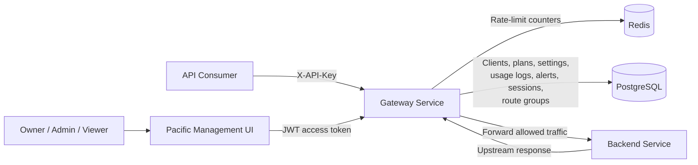
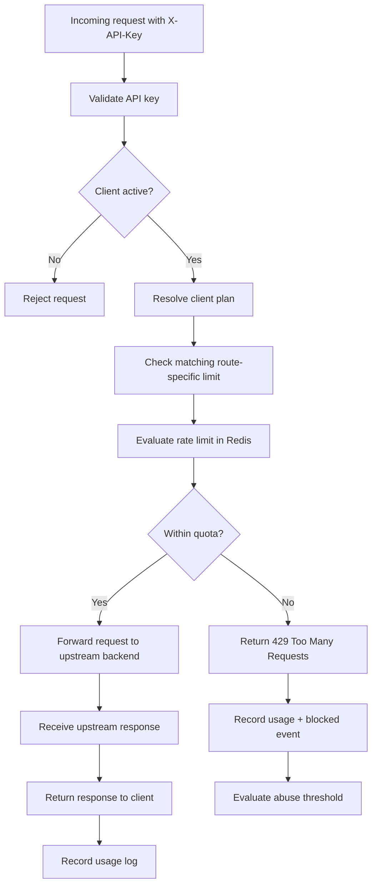
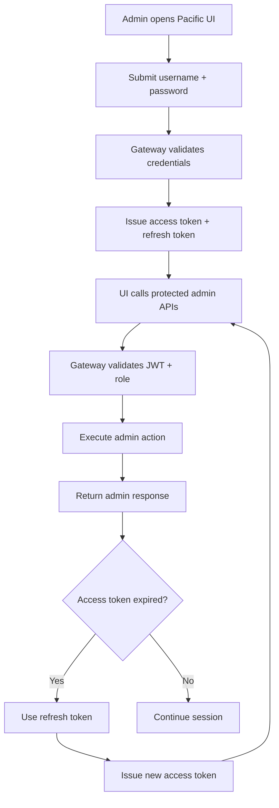
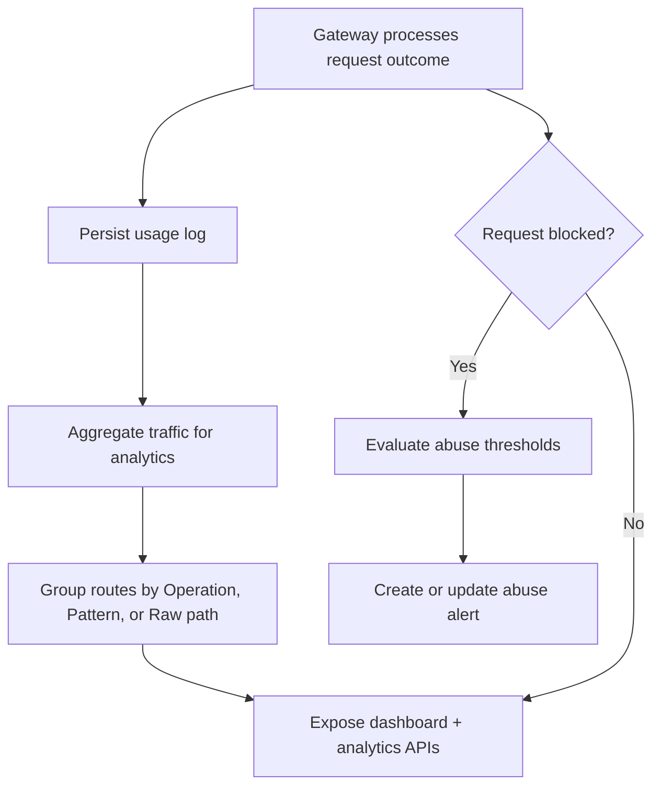
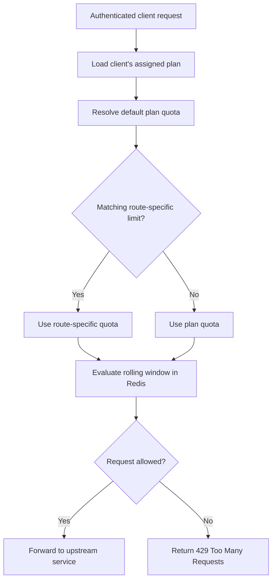

# Pacific — Smart API Gateway

Pacific is a self-hostable API gateway and API management platform for teams that need API keys, rate limits, usage analytics, abuse alerts, and a clean operator UI without adopting a large enterprise gateway stack.

Built with Spring Boot, Redis, PostgreSQL, Docker, and a responsive React management UI.

Pacific is designed as a developer-first, SaaS-oriented gateway platform for small-to-mid sized teams.

## Why This Project?

Modern applications increasingly rely on API gateways for authentication,
traffic management, rate limiting, observability, and security.

Existing solutions such as Kong, AWS API Gateway, Apigee, and NGINX-based setups
are powerful, but can be very expensive and often optimized toward either:

- infrastructure-heavy configurations
- enterprise-scale deployments
- or paid platform ecosystems

At the same time, many free open-source gateway solutions provide strong routing and proxy capabilities but lack 
built-in product-oriented features such as:
- plan-based quota management
- integrated analytics
- abuse monitoring
- developer-focused administration
- and simplified onboarding experiences

Pacific was built to explore a middle ground:
a developer-first, self-hostable API management platform that combines infrastructure capabilities with SaaS-style management features.

The goal is not to compete with low-level high-performance proxies,
but to provide a more accessible and product-oriented gateway experience for developers, startups, and small-to-mid sized teams.

## Current Capabilities

- API key authentication for protected gateway routes.
- Client lifecycle management, including API key rotation, active/disabled states, plan assignment, and stale-client visibility.
- Redis-backed sliding-window rate limiting with plan quotas and route-specific wildcard overrides.
- Dashboard, client, route, and time-series traffic analytics with 7d, 30d, 90d, and 12m ranges.
- Route analytics grouped by developer-defined operations, normalized route patterns, or raw request paths.
- Configurable route groups with method-aware Exact, Prefix, and Glob matching rules.
- Usage logging and abuse detection with `OPEN`, `ACKNOWLEDGED`, and `RESOLVED` alert states.
- JWT admin authentication with refresh sessions, logout, password reset, strong password enforcement, and role-based access control.
- Last-owner protection with optional break-glass Owner recovery guarded by `ADMIN_RECOVERY_TOKEN`.
- Manual client management through the Pacific UI and admin API.
- Server-to-server client onboarding through restricted provisioning tokens.
- Database-backed gateway settings for upstream routing, health checks, request timeout, and connection testing.
- Dockerized services and a responsive React management UI for desktop and mobile operation.

## Architecture Overview

Pacific is a containerized, multi-service API management platform. The Gateway Service sits between API consumers, platform operators, and upstream backend services, enforcing traffic policies while exposing administrative APIs through the Pacific Management UI.



### API Consumer Request Flow



### Admin Platform Flow



### Analytics and Abuse Monitoring Flow



### Service Responsibilities

| Service | Responsibility |
|---|---|
| **Pacific Management UI** | React and TypeScript operator interface for managing clients, plans, rate limits, route groups, analytics, abuse alerts, admins, provisioning tokens, and gateway settings. It communicates with the Gateway Service through the browser-accessible API. |
| **Gateway Service** | Core Spring Boot application responsible for API key validation, client-state checks, quota resolution, Redis-backed rate limiting, upstream forwarding, usage logging, abuse detection, admin authentication, role-based authorization, provisioning, and runtime gateway configuration. |
| **Redis** | Stores shared sliding-window rate-limit counters so multiple gateway instances can evaluate requests against the same quota state. |
| **PostgreSQL** | Stores persistent platform data, including clients, plans, route limits, route groups, gateway settings, usage logs, abuse alerts, admins, refresh sessions, and provisioning tokens. |
| **Backend Service** | Demonstration upstream application used for routing examples, integration testing, and validating gateway behavior. |

## Core Features

### Traffic Management

Pacific applies traffic policies at the gateway before requests reach the upstream service.



#### Plan-Based Quotas

Clients are assigned to centralized plans with configurable default request limits. Pacific seeds `FREE`, `PRO`, and `ENTERPRISE` plans for local demonstrations, and operators can create additional plans through the UI or admin API.

Updating a plan changes the default quota for clients assigned to it without requiring individual client configuration.

#### Route-Specific Rate Limits

Routes with different operational costs can override a plan’s default quota.

For example, report generation or AI-processing endpoints can use stricter limits than lightweight read endpoints while remaining part of the same client plan.

Supported route patterns include:

- exact paths, such as `/api/products`
- one-segment wildcards, such as `/api/users/*`
- nested wildcards, such as `/api/reports/**`

When multiple policies could apply, the matching route-specific limit takes precedence over the plan default.

#### Redis-Backed Sliding Window

Pacific evaluates quotas using Redis-backed sliding-window counters over a rolling 60-second period.

Because rate-limit state is stored outside the gateway process, multiple gateway instances can share the same counters instead of enforcing separate in-memory limits.

### Gateway Configuration

Gateway forwarding settings are stored in PostgreSQL and can be managed through the Pacific UI or admin API.

Current settings include:

- upstream base URL
- health-check path
- request timeout

The gateway uses the saved upstream URL when valid configuration is available. If runtime configuration is unavailable, it falls back to deployment configuration such as `BACKEND_SERVICE_URL`.

Operators can test saved or draft settings before applying them using:

```http
POST /admin/settings/gateway/test-connection
```

## Deployment

Pacific is containerized with separate services for the management UI, gateway, demo backend, PostgreSQL, and Redis.

Configuration is environment-variable driven. The root `.env.example` documents the local configuration contract.

- [Deployment Guide](docs/DEPLOYMENT.md)
- [Railway Deployment](docs/RAILWAY_DEPLOYMENT.md)
- [Demo Script](docs/DEMO_SCRIPT.md)

## Run Locally

### Prerequisites

- Docker with Docker Compose
- Git

### Start Pacific

```bash
git clone https://github.com/pchak00/smart-api-gateway.git
cd smart-api-gateway
docker compose up --build
```

Once the services are running:

| Service | URL |
|---|---|
| Pacific Management UI | `http://localhost:3000` |
| Gateway and Admin API | `http://localhost:8080` |
| Demo Backend | `http://localhost:8081` |

Local demo credentials and the complete walkthrough are available in the [Demo Script](docs/DEMO_SCRIPT.md).

Stop the platform with:

```bash
docker compose down
```

### Verify the Gateway

```bash
curl -i http://localhost:8080/api/products \
  -H "X-API-Key: free-demo-api-key"
```

The gateway validates the API key, applies the matching quota, forwards allowed traffic, and records the result for analytics.

## Documentation

- [API Examples](docs/API_EXAMPLES.md) — authentication, clients, plans, routes, analytics, alerts, and admin operations
- [Client Provisioning](docs/CLIENT_PROVISIONING.md) — server-to-server client onboarding
- [Deployment Guide](docs/DEPLOYMENT.md) — environment configuration and deployment requirements
- [Railway Deployment](docs/RAILWAY_DEPLOYMENT.md) — Railway-specific setup
- [Demo Script](docs/DEMO_SCRIPT.md) — complete local and public walkthrough

## Upcoming Updates

Planned improvements and future platform enhancements include:

### Advanced Rate Limiting Algorithms

The current implementation uses Redis-backed sliding-window rate limiting for rolling 60-second enforcement.

Future versions will introduce:
- token bucket algorithms
- burst traffic handling
- dynamic quota policies

to provide more accurate and flexible traffic control behavior.

### Multi-Tenant Platform Support

Future versions will support tenant or organization-level resource management, allowing multiple teams or companies to manage clients, plans, and gateway configuration within isolated platform boundaries.

### Webhook-Based Alerting

The abuse detection system may be extended with webhook notifications for operational alerts such as:
- repeated rate limit violations
- suspicious traffic activity
- quota exhaustion events

### Platform Hardening and Configuration

Planned incremental improvements include:
- multi-upstream route mapping for more advanced deployments
- API key hashing with key-prefix lookup
- a public developer self-service portal
- richer alert notifications and webhook delivery
- pagination and filtering improvements for large admin datasets
- an isolated test profile or Testcontainers so Spring context tests do not require a local PostgreSQL instance

## Feedback & Contributions

Feedback, bug reports, and improvement suggestions are welcome.

If you encounter issues while running the platform or have ideas for improvements, feel free to open an issue or reach out through GitHub discussions.
